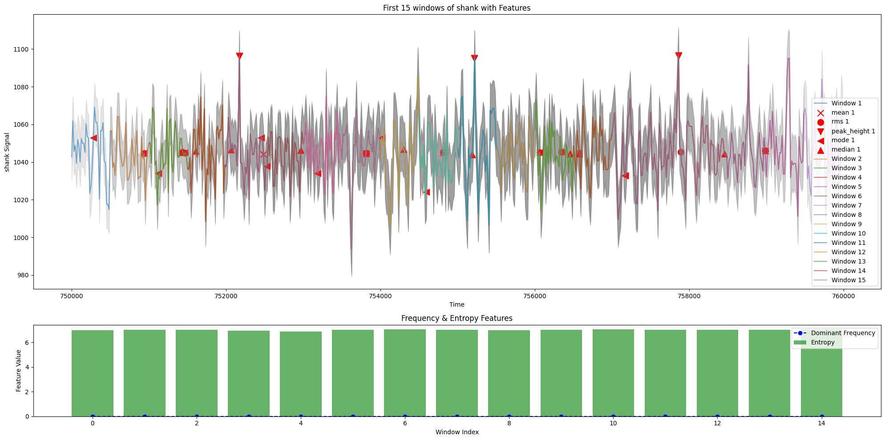

# GaitSetPy

GaitSetPy is a Python package for gait analysis and recognition. This package provides tools and algorithms to process and analyze gait data, enabling researchers and developers to build applications for gait recognition and clinical gait assessment.

## Features

- Gait data preprocessing
- Feature extraction
- Gait recognition algorithms
- Visualization tools

## Installation

You can install GaitSetPy using pip:

```bash
git clone https://github.com/Alohomora-Labs/gaitSetPy.git
python setup.py install
```

Optionally, also install requirements
``` bash
pip install -r requirements.txt
```

## Usage

Here is a simple example to get you started with GaitSetPy:

```python
import gaitsetpy as gsp

# Load gait data
daphnet, names = gsp.load_daphnet_data("")

# Preprocess data
sliding_windows = gsp.create_sliding_windows(daphnet, names)

# Extract features
features = gsp.extract_gait_features(sliding_windows[0]['windows'], 64, True, True, True)

# Visualize gait features
gsp.plot_sensor_with_features(sliding_windows[0]['windows'], features, sensor_name="shank", num_windows=15)
```


``` python

# Train a Random Forest
rf_model = gsp.RandomForestModel(n_estimators=50, random_state=42, max_depth=10)
rf_model.train(features)

# Load a pretrained model
rf_model.load_pretrained_weights("random_forest_model_40_10.pkl")

# Evaluate Model
gsp.evaluate_model(rf_model.model, features) # Assuming 'rf_model' is your trained RandomForestModel instance
```

## Documentation

For detailed documentation and API reference, please visit the [official documentation](https://alohomora-labs.github.io/gaitSetPy/docs_gaitsetpy.html).

## Contributing

We welcome contributions! Please read our [contributing guidelines](CONTRIBUTING.md) to get started.

## License

This project is licensed under the GNU GPL License. See the [LICENSE](LICENSE) file for more details.

## Contact

For any questions or inquiries, please contact us at [jayeeta.chakrabortyfcs@kiit.ac.in](mailto:jayeeta.chakrabortyfcs@kiit.ac.in) or [aharshit123456@gmail.com](mailto:aharshit123456@gmail.com).
